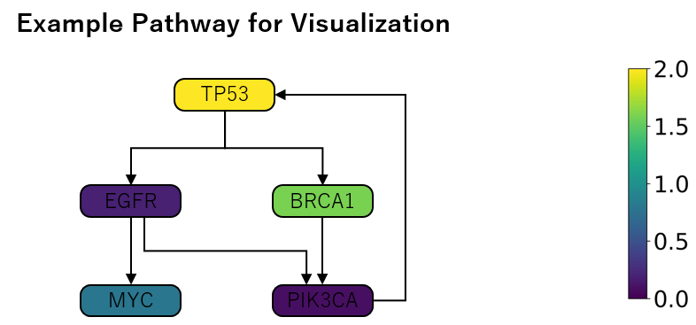

# PathwayColorMapper: PowerPoint-Based Visualization of Gene Expression Data on Pathway Diagrams

**PathwayColorMapper** is a Python tool that allows researchers to visualize gene-associated data, such as gene expression levels, directly on pathway diagrams within PowerPoint files. This enables intuitive, presentation-ready mapping of complex datasets using customizable color scales.

## Features
- **Custom Pathway Diagram Support**: Annotate any PowerPoint-based pathway diagram with your data.
- **Color Mapping**: Use gradient color scales to represent numerical data such as upregulation and downregulation.
- **Automated Processing**: Automatically map data values to diagram regions.
- **PowerPoint Output**: Create editable PowerPoint slides for further customization and presentations.
- **Flexible Data Input**: Accepts standard data formats like CSV or Excel for easy integration.

---

## Project Structure

```
PathwayColorMapper/
├── README.md                     # Documentation with project overview and usage instructions
├── LICENSE.txt                   # MIT License file for the project
├── config/
│   └── config.yaml               # Configuration file defining color scales, ranges, and gradients
├── examples/
│   ├── example_data.csv          # Example gene expression data in CSV format (raw data)
│   ├── example_data_scaled.csv   # Example gene expression data in CSV format (Z-score normalized data)
│   ├── example_pathway.pptx      # Example PowerPoint file with a blank pathway diagram
│   ├── example_output.png        # Example image output showing annotated pathway (raw data)
│   ├── example_output_scaled.png # Example image output showing annotated pathway (scaled data)
├── output/                       # Directory for all generated outputs
│   ├── colorbar_vertical.png     # Generated vertical colorbar image
│   ├── colorbar_horizontal.png   # Generated horizontal colorbar image
│   ├── example_output.pptx       # Example annotated PowerPoint file (raw data)
│   ├── example_output_scaled.pptx# Example annotated PowerPoint file (scaled data)
├── scripts/
│   └── gene_pathway_plot.py      # Main Python script to annotate pathways with color-coded data
├── requirements.txt              # List of Python dependencies needed to run the project
├── .gitignore                    # Specifies files and directories to ignore in version control
```

---

## Installation

### Requirements

- Python 3.8+
- Libraries listed in `requirements.txt`.

### Steps

1. Clone the repository:
   ```bash
   git clone https://github.com/kyoshimr/PathwayColorMapper.git
   ```

2. Navigate to the project directory:
   ```bash
   cd PathwayColorMapper
   ```

3. Install the required dependencies:
   ```bash
   pip install -r requirements.txt
   ```

---

## Usage

### Input Data Format

Prepare your data in a CSV or Excel file with the following format:

| Gene | Value  |
|------|--------|
| TP53 | 2.5    |
| EGFR | -1.2   |
| BRCA1 | 1.8    |
| MYC  | 0.5    |
| PIK3CA | -0.8  |


### Steps to Generate Pathway Visualization

1. Prepare your input files:
   - Gene expression data in CSV or Excel format (see `examples/example_data_scaled.csv`).
   - Pathway diagram in PowerPoint format (see `examples/example_pathway.pptx`).
2. Run the script:
   ```bash
   python scripts/pathway_color_mapper.py --input data.csv --pathway pathway.pptx --output output.pptx
   ```
3. Open the output file:
   - `output.pptx` contains the annotated pathway with color-coded genes.

---

## Example

### Input Pathway Diagram

A blank or pre-designed pathway diagram in PowerPoint:


### Output Pathway Diagram

Annotated pathway with a heatmap overlay:


---

## Example Data

Sample input files are provided in the `examples/` directory to help you get started.

### Files

- `examples/example_data_scaled.csv`: A CSV file containing sample gene expression data.
- `examples/example_data_scaled.xlsx`: An Excel version of the same data.
- `examples/example_pathway.pptx`: A blank PowerPoint pathway diagram.

### How to Use

Run the script with the provided sample data:
```bash
python scripts/pathway_color_mapper.py --input examples/example_data_scaled.csv --pathway examples/example_pathway.pptx --output output/example_output_scaled.pptx
```
This will generate an annotated pathway diagram in `output/example_output_scaled.pptx`.

---

## Configuration

The behavior of the script is controlled by `config/config.yaml`. Customize the following settings:

- **Color Scale**: Define the gradient and range for color mapping.
- **Input/Output Settings**: Adjust file paths and additional parameters.

Example `config.yaml` for Z-score normalized data:
```yaml
color_scale:
  min_value: -2.0  # Minimum value for the color scale
  max_value: 2.0   # Maximum value for the color scale
  gradient:        # Colors for the color scale
    - color: blue  # Corresponds to negative values
    - color: white # Corresponds to mid values
    - color: red   # Corresponds to positive values
```

Example `config.yaml` for raw data (e.g., TPM):
```yaml
color_scale:
  min_value: 0       # Minimum value for the color scale
  max_value: 2.0     # Maximum value for the color scale
  gradient:  viridis # Colors for the color scale
```

Mapped pathway with example raw data:



---

## Dependencies

- `pandas`
- `matplotlib`
- `python-pptx`
- `pyyaml`

Install them using:

```bash
pip install -r requirements.txt
```

---

## Contributing

Contributions are welcome! If you have suggestions for improvements, encounter bugs, or want to add features, feel free to submit an issue or pull request.

---

## License

This project is licensed under the MIT License. See the [LICENSE](LICENSE.txt) file for details.

---

## Acknowledgements

PathwayColorMapper was created to simplify the visualization of complex genomic datasets in a pathway context. Special thanks to the open-source community for making tools like `python-pptx` and `matplotlib` available for projects like this.
